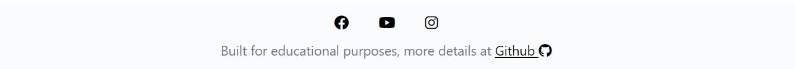
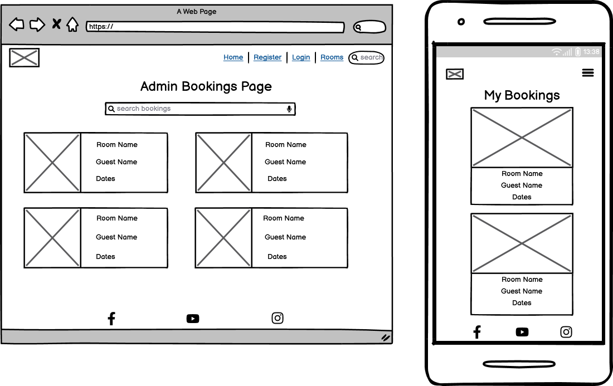

# Lighthouse B&B

Lightouse B&B is a fictional bed and breakfast in County Mayo, Ireland. The site is built
with Django, consists of home app, users app, rooms app & bookings app. They all combine into a system
with users, rooms and bookings management capabilities. The live site deployed on Heroku
can be accessed here [Lighthouse BnB](https://lighthouse-bnb.herokuapp.com/).

## Table of contents

- [User Experience Design](#user-experience-design)
  - [The Strategy Plane](#the-strategy-plane)
    - [Site Goals](#site-goals)
    - [Agile Planning](#agile-planning)
      - [Epics & User Stories ](#epics-and-user-stories)
  - [The Scope Plane](#the-scope-plane)
  - [The Structure Plane](#the-structure-plane)
    - [Features](#features)
    - [Future Features](#future-features)
  - [The Skeleton Plane](#the-skeleton-plane)
    - [Wireframes](#wireframes)
    - [Database Design](#database-design)
  - [The Surface Plane](#the-surface-plane)
    - [Design](#design)
    - [Colour Palette](#colour-palette)
    - [Typography](#typography)
    - [Imagery](#imagery)
- [Technologies](#technologies)
- [Testing](#testing)
- [Deployment](#deployment)
  - [Version Control](#version-control)
  - [Heroku Deployment](#heroku-deployment)
  - [Fork Project](#fork-project)
  - [Clone Project](#fork-project)
- [Credits](#credits)

# User Experience Design

## The Strategy Plane

### Site-Goals

The primary goal of the site is to showcase the B&B and it's unique location to potential guests. Guests
can view rooms list and rooms details, they are also given some functionality to independently register, log in,
make and manage their bookings, which allows them more flexibility without needing to contact the B&B.
Staff admin users can manage all bookings (create, update, delete), as well as rooms (create, update, delete) via the website. Staff superusers can also manage users in the Django admin portal.

### Agile Planning

The project was developed with agile approach. Work was delivered in small increments spread over 4 sprints. The tasks were
categorized in a total of 7 epics and 26 user stories. Each user story was assigned approximation of story points. Each user story was
also given one of the 3 labels - must have, should have, could have. User stories were given acceptance criteria and a list of tasks to complete. All user stories were moved following To Do - In Progess - Done methodology. Some of the could have user stories were moved to a Won't Do category, as they were postponed for future deployments.  
User stories were created from a custom GitHub issue template, which had also been created for this project. Completed user stories were closed as issues, while the future ones were left as open issues. Kanban board from Github Project was used and can be viewed
[here](https://github.com/users/AgaToma/projects/3/views/1).

#### Epics & User Stories 

**Epic 1 - Setup**  
User stories:

- Initial setup of Django and database - As a Developer, I can use Django and a database, so that I can build the website
- Early deployment on Heroku - As a Developer, I can deploy the project early, so that I can ensure it works

**Epic 2 - Users app & authentication**  
User stories:

- Guest registration - As a Guest, I can register only with my email and password, so that I can make a booking
- Registered guests are able to login and logout - As a User, I can login and logout, so that I can see my booking
- Consistency of account pages with website design - As a User, I can experience visual consistency across the website, so that there's no confusion
- Staff user - As a staff superuser, I can access the admin functionalities of the system, so that I can assist guests

**Epic 3 - Rooms app**  

- Guest users can view rooms - As a User, I can view listed rooms, so that I can make my selection
- Guest users can view room details - As a User, I can see the details of the room, so that I can decide if I would book it
- Staff users have CRUD access on Room model - Admin user is able to create, update and delete rooms

**Epic 4 - Bookings app**  

- Guest users can book a room - As a Guest, I can book a room, so that I can enjoy my stay
- Booking confirmation and details for guests - As a Guest, I can receive a booking ID and view details, so that I know my booking is confirmed and can check the details later
- Guest user can amend their bookings - As a Guest, I can amend my booking, so that my plans can be flexible
- Booking management by staff user - As a Staff user, I can manage bookings without having to log in to admin portal, so that I can assist guests
- Price in rooms and bookings apps - As a Guest, I can see room and booking price, so that I can prepare to pay
  As a staff member, I can see room and booking price, so that I can inform the guests

**Epic 5 - Landing page & error pages**  

- Landing page - As a Guest, I can see visual representation of the b&b on the landing page, so that I can identify what the B&B is about
- Site navigation - As a site user, I can easily navigate, so that I can get where I want on the site
- Home app - As a developer, I can use home url, so that I can confirm the project is running correctly
- Error pages - As a site user, I can clearly see the error, so that I know what went wrong

**Epic 6 - Deployment**  

- Deployment - As a user, I can view live website in production, so that I can use it's functionality

**Epic 7 - Documentation**  

- Documentation - As a Developer, I can keep detailed documentation, so that I can refer to it in the future or share with others

## The Scope Plane

**Intuitive UI and relevant content**

- Navigation available throughout the site
- Visual feedback given to users when needed
- Page content relevant to purpose with matching descriptive headings

**Responsiveness**  
Site is functional and maintains full presentabillity on different screen sizes from 320 px up.

**CRUD**

- Guest users can create, view, update and delete their own bookings (Boookings App)
- Staff users can create, view, update and delete all bookings (Boookings App)
- Staff users can create, view, update and delete rooms (Rooms App)
- Staff superusers can create, view, update and delete users - via Django admin interface (Users App)

**Home page and customized user interface for guest users**

- Guest users can view home page with b&b information
- Guest users can navigate the site via navbar
- Guest users can create accounts with email address and not username
- Navbar is customized depending if user is logged in or not
- Logged in guest users can perform CRUD in customized user interface (detail pages and forms on the site)

**Customized user interface for admin and super users**

- Staff users are site admin users
- Staff users can Guest users can perform CRUD on bookings and rooms in customized user interface (detail pages and forms on the site)
- Staff superusers have role based custom navbar with added admin links

**Security - role based restrictions**

- Separation of staff/admin users and guest users capabilities and access
  - Staff users have more options on their navbar
  - Staff users have more options on room details page
  - Staff users can see all bookings
- Restricting guest user access only to bookings created by them
- Unregistered users have view only access to home page and rooms

**Backend organized in separate apps**

- Home app
- Users app
- Rooms app
- Bookings app

## The Structure Plane

### Flow

**Users not registered/logged in - basic access**

- Can view home page and rooms list without option to book
- Need to register or log in if already registered to access more features

**Logged in guest users - registered guest access**

- Can book rooms after proceeding via links from home page or room details page to New Booking page/form
- Can view, update, delete self created bookings via My Bookings page -> Booking details

**Staff users - admin access**

- Can create rooms via Create Rooms page/form
- Can update and delete rooms via Edit Room page/form
- Can view, update, delete all bookings via My Bookings page -> Booking details

**Staff users - superuser access**

- Can perform a more detailed booking search in Django admin interface
- Can create view, update, delete custom users via Django admin interface

### Features

**Navigation**

Site wide responsive Bootrstrap navbar was added for easy navigation between pages. To achieve responsiveness it
collapses to hamburger on smaller screens. It contains different links depending on whether the user is logged in and
user role. It also contains a search box for rooms search with custom tooltip containing search instructions.
Navbar is placed in the header template (main project templates).

**Footer**

Footer is visible across all pages on the site. It contains social media links, so that guests can follow the b&b, if they like.

**Home page**  
The goal of home page is to present the B&B to potential guests and get them interested. It contains hero image, bed and breakfast description with information about rooms, breakfasts, bookings and payments. Bookings and payments section is collapsible to avoid clutter on smaller devices. There is also a Bootstrap carousel with more breakfast details.
Below description, there is a location information. Home page is part of a home app, shown from index template.

**Sign up form**  
Form is provided to allow users to register. Signup template was taken from allauth module and styled to match the site appearance.

**Log in form**  
Form is provided to allow users to log in. Login template was taken from allauth module and styled to match the site appearance.

**Log out**  
Logout template was taken from allauth module and styled to match the site appearance. Before logging the user out it confirms, if user wants to log out.

**Create room page**

Within the Rooms app, Create Room page with form was made to provide a friendly UI to staff admin users without them having to use Django admin, when they need to add a new room to the b&b offer. This is only accessibly to staff users, access is restricted via mixins.

**Edit room page**

Within the Rooms app, Edit room page with form was made to provide a friendly UI to staff users without them having to use Django admin, when they need to edit details of an exisiting room in the b&b offer. This is only accessibly to staff users, access is restricted via mixins.

**Rooms page**

Rooms page was created to show a list of all available rooms on offer. Bootsrap cards were used to display rooms, showing room names, photos and basic details like capacity and view. It's in the Rooms app and is accessible to all viewers of the website without restrictions.

**Room Details**

Users are directed to respective Room details page after clicking on one of the room cards on Rooms page. They can see a more detailed room description there, price and room number. This is visible for any viewers, but options vary depending on permissions. If a user is not logged in, they can see instructions how to book the room (log in or call b&B). If they are logged in, they can see "Book Room" button. If they are admin, they can also see "Edit Room" button, which directs to Edit Room page and "Delete Room", which allows to perform delete operation. Before proceeding with the deletion, user is asked to confirm, it they want to delete.

**New booking page**

New booking page and form are a part of Bookings app. Logged in user can access them from Room Details or Home Page. There is validation implemented to ensure the input of required and correct information. No fields can be left empty, if a room with less capacity then entered is selected a descriptive error message is displayed to the user, if user selects earlier check out than check in, a descriptive error message is also displayed. If the selected room is not available during selected dates due to another booking, a message is also displayed informing user of the same.

**Bookings list page**

Bookings list page was made within Bookings app, so that logged in users can view their own bookings. Bookings are ordered by check in date. Staff users can see all bookings and can perform search using booking id in this UI. If a search with different parameters is needed, they need to use Django admin interface. Secure access according to designed permissions is ensured via mixins.

**Booking details**

After clicking on the booking card on Bookings list page, the user can view their booking summary. They also have buttons available to edit the booking, which directs to edit booking form or delete booking, where a confirmation is required before deletion is completed.

**403 and 404 error pages**  
Error pages were created for a friendly way of informing the user that they have no access to view a requested page (403) or that a page they requested doesn't exist (404). Both error pages contain a message and link to redirect the user back to home page.

**Confirmation messages**

Pop up messages were implemented to inform the user about successful sign in, log out and booking.

**Favicon**  
Favicon was added to enable user locating the tab easier when multiple tabs are open.

### Future Features

- Room availability calendar - to show guests when the room they want to book is available
- Room rating
- Room capacity for children
- Further enhancement of Users app & authentication, using already prepared features like full name

## The Skeleton Plane

### Wireframes

Wireframes were created with Balsamiq. Click below to expand for details.

  
Home page

  
Sign up page

  
Log in page

  
Log out page

  
Rooms page

  
Create room page

  
Edit room page

  
Room details page

  
New booking page

  
My bookings page

  
Booking details page

### Database Design

This project uses PostresQL database hosted on [Elephant SQL](https://www.elephantsql.com/). There are three custom models in the database: Custom User, Room and Booking. The models are related via Foreign Key relationships. Relationship type can be viewed on the first diagram which was drawn for the design of the database using [Draw SQL](https://drawsql.app/). The second diagram was generated after completion of the project from the ready database with [DBeaver](https://dbeaver.io/).
Social accounts, groups and emails models from allauth modules visible in Django admin were not actively used in the current version, but were left for future deployments.

## The Surface Plane

### Design

Site is responsive and features multiple pages to avoid clutter. It features Bootstrap navbar and cards to
enhance balance and responsiveness and also Bootstrap carousel for an attractive look. Bootrstrap collapsibles were implemented
in description on home page to avoid text clutter on smaller devices. Navbar links have active class, all links highlight on hover with the exception of logo link. This link is primarily implemented for SEO optimization and highlighting logo was not in harmony with the rest of navbar.

### Color palette

Light colors were primarily used, whites and light grays. Light shades of green and blue were used
for active classes and background effects. Colors were chosed to harmonize with the hero image.

### Typography

Courgette and Marck Script, both cursive fonts were used to overwrite the default Bootstrap and browser styles for navbar and headings only. Fonts were obtained from Google fonts.

### Imagery

B&B logo was created on Canva. Hero image and room images were taken from [Pexels](https://www.pexels.com/). All photos were
selected to match the light color design of the site aligned with sea, sky, cliffs and lighthouse colors of the hero image.

# Technologies

- HTML - the structure of the website was developed using HTML
- CSS - the website was styled using custom CSS in an external file
- Python - for programming within Django framework
- [Django](https://www.djangoproject.com/) - framework for building the project using Python as programming language
- [Bootstrap 5](https://getbootstrap.com/docs/5.0/getting-started/introduction/) - used for adding some predefined elements and styling
- Jinja/Django templating - used to inject dynamic data and queries into HTML pages
- [Favicon.io](https://favicon.io/) - to make favicon
- [Google fonts](https://fonts.google.com/) - Courgette and Marck Script fonts were used
- Chrome Dev Tools - testing/validation/troubleshooting.
- [CodeAnywhere](https://app.codeanywhere.com/) - website was developed with this IDE in Chrome
- GitHub - for hosting source code
- Git - used to commit and push code during the development of the Website
- [Tinypng](https://tinypng.com/) - was used to reduce the size of the images
- [Convertio](https://convertio.co/) - for JPG format gallery photos to webp
- Balsamiq - to create wireframes
- [Canva](https://www.canva.com/) - to create site logo
- [Heroku](https://id.heroku.com/login) - to deploy and host live site
- [Font Awesome](https://fontawesome.com/) - for icons on the site
- [DrawSQL](https://drawsql.app/) - to create initial DB schema
- [DBeaver](https://dbeaver.io/) - to create ER diagram after deployment
- [Cloudinary](https://cloudinary.com/) - for static storage
- [Elephant SQL](https://www.elephantsql.com/) - PostreSQL DB

**Python modules**

- Django==3.2.19
- Django class based views - ListView, UpdateView, DeleteView, CreateView - for classes to create, edit, delete and display
- Mixins - LoginRequiredMixin, UserPassesTestMixin - for permissions based restrictions
- Q - for search queries
- messages - for showing user feedback
- date, datetime - for date usage and operations
- cloudinary==1.32.0 - static file/image storage
- dj-database-url==0.5.0 - o parse database url for production environment
- dj3-cloudinary-storage==0.0.6 - storage system to work with cloudinary
- django-allauth==0.54.0 - for authentication
- gunicorn==20.1.0 - WSGI server
- oauthlib==3.2.2 - installed as dependency with another packag
- psycopg2==2.9.6 - for Heroku deployment
- django-richtextfield==1.6.1 - for using custom styling on form fields
- django-crispy-forms==2.0 - for serving forms
- crispy-bootstrap5==0.7 - allow bootstrap5 use with crispy forms
- whitenoise - to solve issue with static file loading after deployment to Heroku

# Testing

Tests description and results are available in a separate [TESTING.md](TESTING.md) file.

# Deployment

## Version Control  

The following commands were used for version control.

- git add . - add changes to staging area before committing
- git commit -m "commit message" - committing staged changes to the local repository
- git push - pushing commited changes to the GitHub remote repository

## Heroku deployment

Below steps were followed to deploy the project:

- Log in to Heroku
- Click "New -> Create new app" button
- Insert app name, choose region, click the "Create App" button
- On Settings tab go to "Config vars" section, click "Reveal Config Vars"
- Add the following config vars:
  - SECRET_KEY: (secret key)
  - DATABASE_URL: (postresql url)
  - CLOUNDINARY_URL: (cloudinary api url)
- On Deploy tab go to "Deployment method" and select Github
- Go to "App connected to GitHub", type GitHub repository name to link it
- Manual deployment was chosen on the main branch

## Fork repository

Click Fork button on the top right -> select owner -> optionally change name or add description -> create Fork.

## Clone repository

Click on the code button -> select clone with HTTPS, SSH or GitHub CLI -> copy the link shown -> open terminal in your code editor and change the current working directory to the location you want to use for the cloned directory -> type 'git clone' into the terminal and then paste the copied link -> press enter.

# Credits

## References

Below resources were used as reference when creating the project along with Stack Overflow and Code Institute Slack community posts. 
[Django Wednesdays](https://www.youtube.com/watch?v=HHx3tTQWUx0&list=PLCC34OHNcOtqW9BJmgQPPzUpJ8hl49AGy)  
[Django Recipe Tutorial](https://www.youtube.com/watch?v=sBjbty691eI&list=PLXuTq6OsqZjbCSfiLNb2f1FOs8viArjWy&pp=iAQB)

## Images

- 403 & 404 - freefrontend.com
- breakfast in bed - pexels-lisa-fotios-1843244
- continental breakfast - pexels-burst-374052
- irish breakfast - pexels-emrah-tolu-2662875
- vegan - pexels-pixabay-236795
- gluten free - pexels-taryn-elliott-4099238
- hero img - pexels-magic-k-6726764

## Acknowledgments

Big thanks to my Code Institute mentor [Daisy McGirr](https://github.com/Daisy-McG) - for her guidance, support and useful insights.
