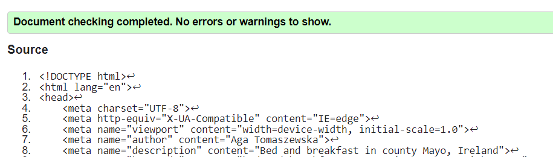
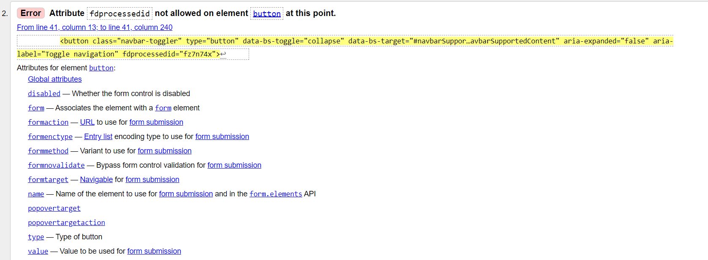
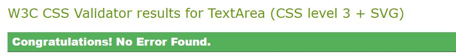
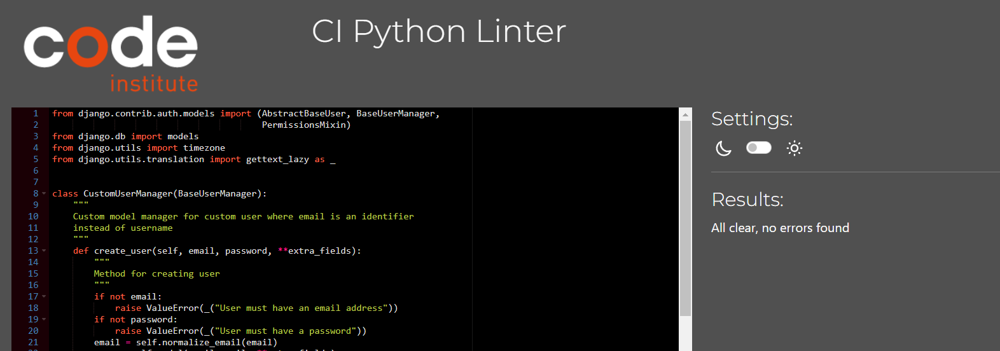
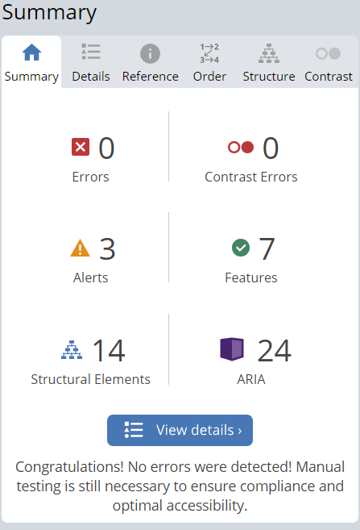
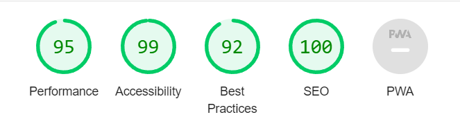

Back to [Readme](README.md)

The site has been thoroughly tested during development, however this document describes tests performed upon completion.

# Table of Contents

- [Functional Testing](#functional-testing)
  - [Links & anchors](#links-anchors)
  - [Forms](#forms)
  - [Booking logic - negative testing](#booking-logic)
  - [Search and ordering](#search-ordering)
  - [Admin](#admin)
- [Validator Testing](#validator-testing)
  - [HTML](#html)
  - [CSS](#css)
  - [Python](#python)
- [Accessibility](#accessibility)
- [Responsiveness](#responsiveness)
- [Lighthouse Report](#lighthouse-report)
- [Unit Tests](#unit-tests)
- [Bugs](#bugs)

# Functional Testing

## Links & anchors

**Description**
Test all links on the site to ensure they direct to correct pages.

**Steps to test**

Click all listed links and anchors -> Check if the correct page displays

Tested Navigation Links:

- Home -> index.html
- Register -> signup.html
- Log in -> login.html
- Log out -> logout.html
- Rooms -> rooms.html
- Book -> new_booking.html
- My Bookings -> mybookings.html
- Admin -> Django admin

Links from Home page (index.html):

- Rooms page - rooms.html
- Booking form - new_booking.html
- Show on map - external google maps link with location
- Logo link - directs to home page, introduced for SEO, navigation use only secondary

Collapsibles on Home page (index.html)

- Payments and bookings - displays relevant content
- Find us - displays relevant content

Anchors - cards:

- Rooms page cards - open detail pages for correct rooms (room_details.html)
- Bookings page cards - open booking detail pages for correct bookings (booking_details.html)

Anchors - buttons:

- Rooms page (admin access):

  - Create Room - add_room.html

- Room details:

  - Book Room - new_booking.html
  - Edit Room - edit_room.html
  - Delete Room - delete_room.html

- Booking details:

  - Edit Booking - edit_booking.html
  - Delete Booking - delete_booking.html

- Edit Room:

  - Cancel - rooms.html

- Edit Booking:
  - Cancel - mybookings.html

**Expected result**
Correct pages and/or content display from all links

**Actual Result**
As Expected

**Assessment**
Pass

## Forms

**Description:**
Test all forms on the site to ensure they function as designed.

### Authentication (Users)

#### Sign up

Test 1:
**Steps to test**

Enter email address -> Enter password -> Repeat same password -> Click submit

**Expected result**
Form submits, new user is created, success message is displayed to user, new user is showing in admin

Test 2:
**Steps to test**

Enter email address -> Enter password -> Enter different password -> Click submit

**Expected result**
Form doesn't sumbit, password doesn't match error message is displayed to user

**Actual Results**
As Expected

**Assessment**
Pass

#### Log in

Test 1:

**Steps to test**

Enter email address -> Enter password -> Click Sign in

**Expected result**
Form submits, user is logged in, success message is displayed to user

Test 2:
**Steps to test**

Enter email address -> Enter wrong password -> Click Sign in

**Expected result**
Form doesn't sumbit, password doesn't match error message is displayed to user

**Actual Results**
As Expected

**Assessment**
Pass

#### Log out

**Steps to test**

Click Sign out button on navbar -> Click Signout on confirmation

**Expected result**
User gets logged out

**Actual Result**
As Expected

**Assessment**
Pass

### Rooms

#### Create Room

Test 1:

**Steps to test**

Enter room name & number -> Select view from dropdown -> Enter number of people, price, description - > Select photo -> enter alt
-> click submit

**Expected result**
Fields display on form as designed, form submits, room is created with all fields displayed as selected on the form

Test 2:
**Steps to test**
Fill out all fields on the form, but omit number of people

**Expected result**
Form doesn't submit and scrolls to the field that needs to be filled out, if photo or photo alt field a message shows to fill them out

**Actual Results**
As Expected

**Assessment**
Pass

#### Edit Room

Test 1:
**Steps to test**
Edit price -> click Submit

**Expected result**
Form submits, price field is displayed with the new value

Test 2:
**Steps to test**
Remove price value -> click Submit

**Expected result**
Form doesn't submit, a message shows to fill out the price field

**Actual Results**
As Expected - As a result of testing edit forms, a need for Cancel button was identified to increase edit forms user friendliness.

**Assessment**
Pass

### Bookings

#### New Booking

Test 1:
**Steps to test**

Select room name from dropdown -> Enter main guest name -> Select check in and check out dates from calendar widgets - > Select number of guests from dropdown -> click submit booking -> open booking details by clicking on booking card

**Expected result**
Fields display on form as designed, calendar widget works, form submits, success message displays to user, booking is created with all fields displayed as selected on the form and can be seen on My Bookings page

Test 2:
**Steps to test**
Fill out all fields on the form, but omit main guest name

**Expected result**
Form doesn't submit, a message shows to fill out main guest name

**Actual Results**
As Expected - only basic form functionality was tested in this step, booking submit logic is tested separately at [Booking Logic](#booking-logic)

**Assessment**
Pass

#### Edit Booking

Test 1:
**Steps to test**

Change main guest name -> Select different check out date on widget -> click submit -> open booking details by clicking on booking card

**Expected result**
Form submits, success message displays to user, booking is updated with changes done on relevant fields and can be seen as such on My Bookings page

Test 2:
**Steps to test**
Leave main guest name empty

**Expected result**
Form doesn't submit, a message shows to fill out main guest name

**Actual Results**
As Expected - only basic form functionality was tested in this step, booking submit logic is tested separately at [Booking Logic](#booking-logic)

**Assessment**
Pass

## Booking logic - negative testing

**Description**
Test that bookings are submitted according to the designed logic via New Booking and Edit Booking forms via negative testing.

### Check in is earlier than check out

Test 1: **Steps to test**

Enter check out date that's earlier than check in date

**Expected result**
Form doesn't submit, a message shows that check in needs to be before check out

Test 2: **Steps to test**

Enter check out date on the same date as check in date

**Expected result**
Form doesn't submit, a message shows that check in needs to be before check out

**Actual Results**
As Expected

**Assessment**
Pass

### Number of guests is not larger than room capacity

**Steps to test**

Select room Swing Hideaway under room name (sleeps 1) -> select 2 people on the booking -> click Submit Booking

**Expected result**
Form doesn't submit, a message shows that the room is too small for 2 people and to choose a bigger room.

**Actual Results**
As Expected (Error message was missing a space between words - this has been corrected)

**Assessment**
Pass

### No duplicate bookings allowed for the same room

**Steps to test**

Select room Lighthouse Suite from the dropdown -> select check in between check in and check out of an already made booking -> click Submit Booking

**Expected result**
Form doesn't submit, a message shows that the room is not available on the selected dates.

**Actual Results**
As Expected

**Assessment**
Pass

### Booking price calculated correctly

**Steps to test**

Check if on a submitted booking the price equals room price \* number of nights

**Expected result**
Calculation correct

**Actual Results**
As Expected

**Assessment**
Pass

## Search and ordering

### Room search (navbar)

**Steps to test**

Enter number 2 in the search box -> click Search

**Expected result**
Rooms page renders showing only rooms that sleep 2 people (currently Ocean Retreat and Sea Breeze)

**Actual Results**
As Expected

**Assessment**
Pass

### Booking search by id (My Bookings with admin access)

**Steps to test**

Enter number 47 in the search box -> click Search

**Expected result**
Booking with id 47 renders

**Actual Results**
As Expected

**Assessment**
Pass

### Room and booking orderding on page

**Steps to test**

Check on rooms and bookings pages, if they are ordered as designed:

- Rooms by capacity
- Bookings by check in date

**Expected result**
Ordered as designed

**Actual Results**
As Expected

**Assessment**
Pass

## Admin

Testing of admin was also performed to ensure the functionality of the below:

- User management in USERS - Custom Users:
  - Displays user emails and admin status
  - Filtering works according to display fields
  - Details showing (email, hashed password, permissions, advanced - is active, date joined)
- Booking management via BOOKINGS - Bookings:
  - Displays fields as described in admin.py
  - Filters by check in date
  - Searches works by main guest name, room name and created by email, id

As a result of initial testing it was discovered that Bookings search was not working. This was solved by adding **email to created_by and **name to room.

# Validator Testing

## HTML

Validator used - [W3 Markup Validator](https://validator.w3.org/). All pages were tested. Initially 2 errors were found due to button
tag within a tag (closing button on room & booking details) and p tag within span (search bar tooltip). After fixing these home page is rendering no errors.

There are errors showing on forms pages (Create Room and New Booking) related to the form implementation. Validator also highlights errors in the Font Awesome code as rendered in the Elements of Chrome Developer Tools. Hopefully, this is acceptable, as it's not my own custom HTML. The code had to be copied from Elements section of Chrome Dev Tools and validated as text direct input due to the use of templating.

## CSS

Custom CSS code rendered no errors in the [Jigsaw Validator](https://jigsaw.w3.org/css-validator/).

## Python

Initially small errors like trailing whitespaces, no new line at end of document were detected and corrected. All python files with the exception of settings.py are showing no errors.
In settings.py the django auto generated code for AUTH_PASSWORD_VALIDATORS and also cloudinary storage path are showing up as lines too long. I could not find a way to split these lines but since they were auto generated and not my own custom code, I hope this is acceptable.

# Accessibility

Care was taken to ensure sufficient level of accessibility and user friendliness by using semantic HTML elements, aria-labels, appropriate color contrast, different hover and active states. Initial test via [Wave](https://wave.webaim.org/) returned an error with Search button (navbar) contrast, this was corrected by applying a lighter background. Also a warning was displayed about underline on carousel slides, where active class was applied - underline has been removed from carousel active to correct this.

# Responsiveness

All pages were checked for responsiveness on different sizes inspected via Chrome Developer tools. Designed layout behaviour was ensured by adding some media queries, where tests shown that elements were overlapping or too cluttered.
To check responsiveness on diffrent devices site was checked:

- in browsers: Edge and Safari.
- on devices: Samsung Galaxy S8+, iPhone XR, Lenovo Tab M10, Dell Inspiron 14, Dell external widescreen monitor

# Lighthouse Report

Initial results of the report showed poorer performance than desired. This has been rectified by applying the below guidelines from the report:

- further compression of images
- preloading background image
- moving fontawesome script tags from head to the bottom of body element

To improve SEO score, link was added to the site logo thanks to another suggestion from the report.

# Unit Tests
